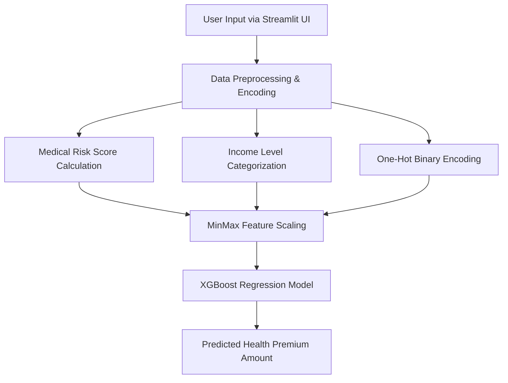

# 🏥 Health Insurance Cost Predictor (ML Web Application)

[](https://healthinsurancepredict.streamlit.app/)
[](https://www.python.org/)
[](https://xgboost.readthedocs.io/)
[](https://scikit-learn.org/)
[](https://opensource.org/licenses/MIT)


> 🚀 **Live App**: Experience the live web application at **[healthinsurancepredict.streamlit.app](https://healthinsurancepredict.streamlit.app/)**

---

## 📌 Executive Summary

The **Health Insurance Cost Predictor** is an end-to-end Machine Learning web application designed to estimate annual health insurance premiums based on individual user demographics, lifestyle factors, medical risk histories, and plan preferences.

By leveraging exploratory data analysis (EDA), custom domain-specific feature engineering (composite medical risk scoring and lifestyle risk metrics), and model hyperparameter tuning via **XGBoost Regressor**, this application provides instant, highly accurate cost estimates through an intuitive **Streamlit** user interface.

---

## 📱 Live Application Interface


*Figure: Real-time user parameter inputs and prediction output (`Predicted Health Insurance Cost: ₹ 4,923`) on Streamlit Community Cloud.*

---

## ✨ Key Features

- 🎯 **Interactive Web Interface**: User-friendly form built with Streamlit allowing real-time input of personal, lifestyle, and medical parameters.
- 🩺 **Domain-Specific Risk Scoring**:
  - **Medical History Risk Score**: Dynamic composite calculation evaluating conditions such as Diabetes, High Blood Pressure, Heart Disease, and Thyroid issues.
  - **Lifestyle Risk Metrics**: Combines physical activity levels and stress ratings.
  - **Income Level Normalization**: Automatically categorizes income ranges into standardized brackets.
- ⚡ **High-Performance ML Pipeline**: Built with optimized gradient boosting (XGBoost) and `MinMaxScaler` feature preprocessing.
- ☁️ **Cloud Deployed**: Fully deployed and publicly accessible via Streamlit Community Cloud.

---

## 🏗️ System Architecture & ML Workflow



---

## 📊 Machine Learning Model & Notebook Performance

The evaluation metrics below are computed directly from model training in [`notebooks/health_premium_common.ipynb`](notebooks/health_premium_common.ipynb):

| Model | $R^2$ Score | RMSE | MSE | Model Highlights |
| :--- | :---: | :---: | :---: | :--- |
| **Linear Regression** | `0.9542` | `1,933.61` | `3,738,839.77` | Baseline linear model |
| **Ridge Regression (alpha=1)** | `0.9542` | `1,933.44` | `3,738,181.58` | Regularized model handling multicollinearity |
| **XGBoost Regressor (Best)** | **`0.9938`** | **`710.49`** | **`504,800.28`** | **Hyperparameter tuned via RandomizedSearchCV (`CV R² = 0.9926`)** |

### Top Predictive Drivers
1. **Total Medical Risk Score** (Derived from medical history)
2. **Age & Income Level**
3. **Insurance Plan Tier** (Bronze / Silver / Gold)
4. **Smoking Status & BMI Category**

---

## 📁 Repository Structure

```
Health-Insurance-Prediction/
├── artifacts/
│   ├── model_rest.joblib          # Trained XGBoost regression model
│   └── scaler_rest.joblib         # Fitted MinMaxScaler object
├── assets/
│   ├── banner.jpg                 # Project header banner
│   └── app_screenshot.png         # Live Streamlit web app interface screenshot
├── data/
│   └── premiums_with_life_style.xlsx  # Dataset
├── notebooks/
│   └── health_premium_common.ipynb   # EDA, feature engineering & model training
├── main.py                        # Streamlit web application frontend
├── prediction_helper.py           # Preprocessing & inference pipeline
├── requirements.txt               # Dependencies for cloud deployment
├── README.md                      # Project documentation
└── .gitignore                     # Git ignore rules
```

---

## 🛠️ Installation & Local Setup

To run this project locally on your machine, follow these steps:

### 1. Clone the Repository
```bash
git clone https://github.com/kamaleshpantra/Health-insurance-premium-prediction.git
cd Health-insurance-premium-prediction
```

### 2. Create and Activate a Virtual Environment
```bash
# Windows
python -m venv .venv
.\.venv\Scripts\activate

# macOS / Linux
python3 -m venv .venv
source .venv/bin/activate
```

### 3. Install Dependencies
```bash
pip install -r requirements.txt
```

### 4. Launch the Streamlit App
```bash
streamlit run main.py
```
Open your browser and navigate to `http://localhost:8501`.

---

## 👨‍💻 Tech Stack

- **Frontend**: Streamlit
- **Machine Learning**: XGBoost, Scikit-Learn, Joblib
- **Data Processing**: Pandas, NumPy
- **Deployment**: Streamlit Cloud, GitHub
