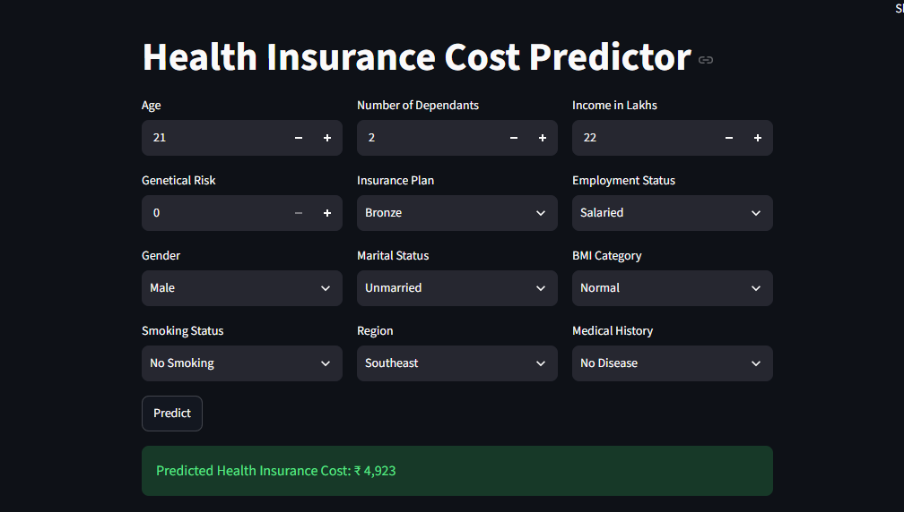
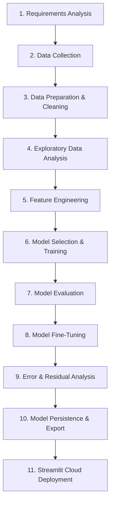

# 🏥 Health Insurance Cost Predictor (ML Web Application)

[](https://healthinsurancepredict.streamlit.app/)
[](https://www.python.org/)
[](https://xgboost.readthedocs.io/)
[](https://scikit-learn.org/)
[](https://opensource.org/licenses/MIT)


> 🚀 **Live App**: Experience the live web application at **[healthinsurancepredict.streamlit.app](https://healthinsurancepredict.streamlit.app/)**

---

## 📌 Executive Summary

The **Health Insurance Cost Predictor** is an end-to-end Machine Learning project designed to estimate annual health insurance premiums based on individual user demographics, lifestyle factors, medical risk histories, and plan preferences.

This project covers the complete ML lifecycle—from initial requirements formulation and data cleaning to feature engineering, hyperparameter tuning, residual error analysis, model persistence, and deployment on **Streamlit Community Cloud**.

---

## 📱 Live Application Interface



*Figure: Real-time user parameter inputs and prediction output (`Predicted Health Insurance Cost: ₹ 4,923`) on Streamlit Community Cloud.*

---

## 🔄 End-to-End Machine Learning Lifecycle (11 Steps)

This project follows an 11-step Machine Learning workflow as implemented in [`notebooks/health_premium_common.ipynb`](notebooks/health_premium_common.ipynb) and the Streamlit application pipeline:



---

### Step 1: Requirements Analysis
- **Goal**: Predict annual individual health insurance premium amounts (`annual_premium_amount`) in local currency.
- **Task Type**: Supervised Continuous Regression.
- **Success Criteria**: Achieve high $R^2$ score ($>0.90$) and low RMSE with zero-centered prediction residuals.

### Step 2: Data Collection
- **Dataset**: `premiums_with_life_style.xlsx` (stored in `data/`).
- **Input Features**: Demographic metrics (Age, Gender, Region, Marital Status, Dependants, Income), Lifestyle factors (Physical Activity, Stress Level, Smoking Status), Medical Attributes (Medical History), and Policy Type (Insurance Plan).

### Step 3: Data Preparation & Cleaning
- **Header Normalization**: Standardized column names to lowercase snake_case.
- **Data Hygiene**: Handled missing records (`dropna()`) and removed identical duplicates (`drop_duplicates()`).
- **Outlier Mitigation**: Calculated Interquartile Range (IQR) limits ($Q1 - 1.5 \times IQR$, $Q3 + 1.5 \times IQR$) to filter extreme age and dependant anomalies; applied 99th percentile upper bound capping on `income_lakhs`.

### Step 4: Exploratory Data Analysis (EDA)
- **Univariate Analysis**: Plotted feature distributions using Seaborn Histograms, Kernel Density Estimation (KDE) plots, and Boxplots.
- **Bivariate Analysis**: Visualized scatter plots of numerical variables vs `annual_premium_amount` and bar charts showing demographic distribution percentages.

### Step 5: Feature Engineering
- **Composite Medical Risk Scoring**: Split multi-disease strings (e.g., `"Diabetes & High blood pressure"`) and calculated a unified `total_risk` score:
  - `Heart Disease`: 8 | `Diabetes`: 6 | `High Blood Pressure`: 6 | `Thyroid`: 5 | `None`: 0
- **Lifestyle Risk Metric**: Created `life_style_risk` combining physical activity rating and stress level rating.
- **Categorical & Ordinal Mapping**:
  - `bmi_category`: Underweight (1), Normal (2), Overweight (3), Obesity (4).
  - `insurance_plan`: Bronze (1), Silver (2), Gold (3).
  - `income_level`: Standardized income brackets (<10L: 1, 10L–25L: 2, 25L–40L: 3, >40L: 4).
  - **Dummy Encoding**: Applied `pd.get_dummies(drop_first=True)` for nominal variables (`gender`, `region`, `marital_status`, `smoking_status`, `employment_status`).
- **Feature Scaling**: Fitted `MinMaxScaler` on `age`, `number_of_dependants`, `income_level`, and `insurance_plan`.
- **Multicollinearity Check**: Verified feature independence via Variance Inflation Factor (VIF).

### Step 6: Model Selection & Training
- Split dataset into 70% Training set and 30% Test set (`random_state=42`).
- Trained and evaluated candidate regressors:
  1. **Linear Regression** (Baseline linear model)
  2. **Ridge Regression** (L2 Regularized linear model)
  3. **XGBoost Regressor** (Gradient boosted decision trees)

### Step 7: Model Evaluation
Evaluated performance using $R^2$ Score, Mean Squared Error (MSE), and Root Mean Squared Error (RMSE):

| Model | $R^2$ Score | RMSE | MSE | Evaluation Remarks |
| :--- | :---: | :---: | :---: | :--- |
| **Linear Regression** | `0.9542` | `1,933.61` | `3,738,839.77` | Strong baseline performance |
| **Ridge Regression ($\alpha=1$)** | `0.9542` | `1,933.44` | `3,738,181.58` | Stabilized linear coefficients |
| **XGBoost Regressor (Best)** | **`0.9938`** | **`710.49`** | **`504,800.28`** | **Superior non-linear feature capture** |

### Step 8: Model Fine-Tuning & Optimization
- Conducted hyperparameter tuning on `XGBRegressor` using `RandomizedSearchCV` with 3-fold cross-validation over parameter grid:
  - `n_estimators`: `[20, 40, 50]`
  - `learning_rate`: `[0.01, 0.1, 0.2]`
  - `max_depth`: `[3, 4, 5]`
- Achieved an optimal 3-fold CV $R^2$ score of **`0.9926`**.

### Step 9: Error Analysis & Residual Diagnostics
- Calculated percentage residual error: $\text{Residual} = \frac{y_{\text{pred}} - y_{\text{test}}}{y_{\text{test}}} \times 100$.
- Plotted residual distribution histogram with KDE to verify zero-centered, normally distributed errors without systematic bias.
- Evaluated feature importance ranking: `total_risk`, `age`, `income_level`, and `insurance_plan` emerged as key cost drivers.

### Step 10: Model Persistence & Export
- Serialized tuned XGBoost estimator into `artifacts/model_rest.joblib`.
- Serialized `MinMaxScaler` object and target feature column names into `artifacts/scaler_rest.joblib`.

### Step 11: Model Deployment & Web App
- Developed frontend application using **Streamlit** (`main.py`).
- Implemented real-time feature transformation pipeline in `prediction_helper.py` to preprocess user inputs, compute risk scores, scale features, and trigger model inference.
- Deployed live on **Streamlit Community Cloud** (`https://healthinsurancepredict.streamlit.app/`).

---

## 📁 Repository Structure

```
Health-Insurance-Prediction/
├── artifacts/
│   ├── model_rest.joblib          # Trained XGBoost regression model
│   └── scaler_rest.joblib         # Fitted MinMaxScaler object
├── assets/
│   ├── banner.jpg                 # Project header banner
│   └── app_screenshot.png         # Live Streamlit web app interface screenshot
├── data/
│   └── premiums_with_life_style.xlsx  # Dataset
├── notebooks/
│   └── health_premium_common.ipynb   # 11-step ML pipeline notebook
├── main.py                        # Streamlit web app UI frontend
├── prediction_helper.py           # Preprocessing & inference pipeline
├── requirements.txt               # Dependencies for cloud deployment
├── README.md                      # Complete project documentation
└── .gitignore                     # Git ignore rules
```

---

## 🛠️ Local Installation & Running

To run this project locally on your machine:

```bash
# 1. Clone Repository
git clone https://github.com/kamaleshpantra/Health-insurance-premium-prediction.git
cd Health-insurance-premium-prediction

# 2. Activate Virtual Environment
python -m venv .venv
.\.venv\Scripts\activate

# 3. Install Dependencies
pip install -r requirements.txt

# 4. Launch Streamlit Application
streamlit run main.py
```

---

## 👨‍💻 Tech Stack

- **Frontend**: Streamlit
- **Machine Learning**: XGBoost, Scikit-Learn, Joblib
- **Data Processing & EDA**: Pandas, NumPy, Seaborn, Matplotlib
- **Deployment**: Streamlit Cloud, GitHub
